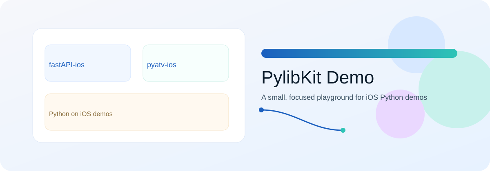
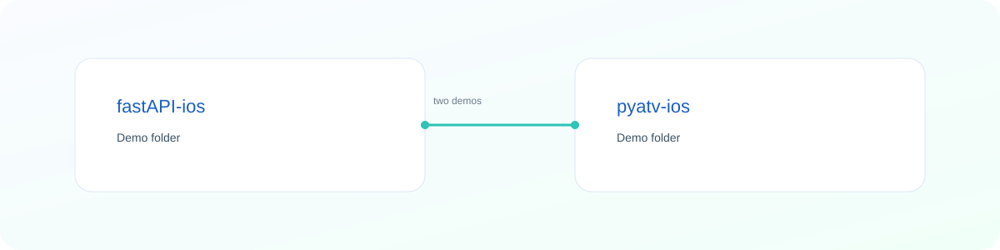

<a id="top"></a>

<div align="center">
  <a href="#english">
    
  </a>
  <h1>PylibKit Demo</h1>
  <p>English-first README with quick links, a visual map, and short translations.</p>
  <p>
    <a href="#english">English</a> •
    <a href="#korean">한국어</a> •
    <a href="#japanese">日本語</a>
  </p>
  <p>
    <a href="#projects">Projects</a> •
    <a href="#quick-start">Quick Start</a> •
    <a href="#structure">Structure</a> •
    <a href="#notes">Notes</a>
  </p>
</div>

---

<a id="english"></a>
## English

### Overview
- This repository is a small collection of iOS demo folders.
- Start with the project list below and explore each folder.
- The README is intentionally compact and navigable.

### Project Map
<a href="#projects">
  
</a>

<a id="projects"></a>
### Projects
<table>
  <tr>
    <td align="center" width="50%">
      <a href="fastAPI-ios/"><strong>fastAPI-ios</strong></a><br />
      <sub>Demo folder</sub>
    </td>
    <td align="center" width="50%">
      <a href="pyatv-ios/"><strong>pyatv-ios</strong></a><br />
      <sub>Demo folder</sub>
    </td>
  </tr>
</table>

<a id="quick-start"></a>
### Quick Start
1. Pick a demo folder: <a href="fastAPI-ios/">fastAPI-ios</a> or <a href="pyatv-ios/">pyatv-ios</a>.
2. Open the folder and look for project files or local docs.
3. Follow the steps inside the selected demo.

<a id="structure"></a>
### Structure
```
PylibKit-Demo/
├─ fastAPI-ios/
├─ pyatv-ios/
└─ assets/
```

<a id="notes"></a>
### Notes
- English is the primary language; Korean and Japanese summaries follow.
- Use the navigation links to jump between sections.

[Back to top](#top)

---

<a id="korean"></a>
## 한국어

### 요약
- 이 저장소는 iOS 데모 폴더 모음입니다.
- 각 폴더에서 프로젝트 파일과 안내 문서를 확인하세요.

### 바로가기
- 프로젝트: <a href="#projects">Projects</a>
- 빠른 시작: <a href="#quick-start">Quick Start</a>
- 구조: <a href="#structure">Structure</a>

[위로](#top)

---

<a id="japanese"></a>
## 日本語

### まとめ
- このリポジトリは iOS デモ用フォルダの集合です。
- 各フォルダ内のプロジェクトやドキュメントを参照してください。

### クイックリンク
- プロジェクト: <a href="#projects">Projects</a>
- クイックスタート: <a href="#quick-start">Quick Start</a>
- 構成: <a href="#structure">Structure</a>

[トップへ](#top)
